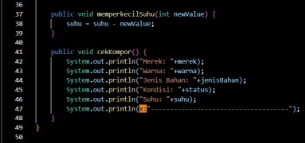

**Praktikum Object Oriented Programming Jobsheet 1** 

**Nama: Riski Abdi Rahmawan NIM: 2241720060** 

**Kelas: 2E** 

**Absen: 25** 

**POLITEKNIK NEGERI MALANG** 

**Jl. Soekarno Hatta No.9, Jatimulyo, Kec. Lowokwaru, Kota Malang, Jawa Timur** 

**65141** 

Jawab: 

1. Objek adalah suatu benda nyata yang lebih spesifik. Sedangkan class adalah gambaran umum dari suatu benda nyata. 
1. karena nantinya pada setiap mobil bisa saja memiliki warna dan tipe mesin yang berbeda- beda. 
1. dapat menghemat penggunaan variable serta meminimalisir duplikat variabel. 
1. boleh 
1. karena class sepedagunung merupakan warisan dari class sepeda sehingga dapat mengakses attribute yang terdapat pada class sepeda. 

Jawab:  1.   

- Kompor listrik 

- Kompor gas 

- Setrika 

- Lampu 

2\.   

- Kompor Listrik 
- Attribute: 
  - Waktu 
  - Daya 
- Method: 
1. mengaturWaktu() 
1. mengaturDaya() 
1. cekKomporListrik() 
- Kompor Gas 
- Attribute: 
  - Jenis Pengatur Suhu 
  - Jenis Piringan 
- Method: 
1. setJenisPengaturSuhu() 
1. setJenisPiringan() 
1. cekKomporGas() 
- Setrika  
- Attribute: 
  - Merek 
  - Warna 
  - Kondisi 
  - Suhu 
- Method 
1. setMerek() 
1. setWarna() 
1. menyala() 
1. mati() 
1. menambahSuhu() 
1. mengurangiSuhu() 
1. cekSetrika() 
- Lampu 
- Attribute: 
  - Merek 
  - Warna Cahaya 
  - Bentuk 
  - Kondisi 
- Method 
1. setMerek() 
1. setWarnaCahaya() 
1. setBentuk() 
1. menyala() 
1. mati() 

 
- kompor listrik 

- kompor gas 

- setrika 

- lampu 

 
- class kompor 

5\.   

- instansiasi objek serta penggunaan method pada class kompor 

- instansiasi objek serta penggunaan method pada class komporlistrik 

- instansiasi objek serta penggunaan method pada class kompor gas 

- instansiasi objek serta penggunaan method pada class setrika 

- instansiasi objek serta penggunaan method pada class lampu 

